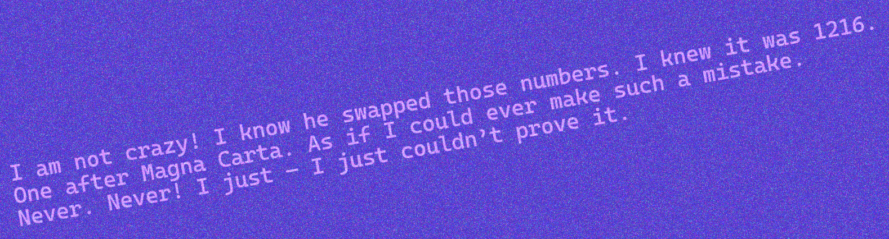

# WaveOCR

WaveOCR is a proof-of-concept C++ implementation of optical character recognition (OCR) with Python bindings, using Fast Fourier Transform
(FFT), alongside custom heuristics, such as non-maximum suppression with intersection-over-union and coefficient norming,
to improve accuracy. It was created as a final project for the C++ course at AGH University of Krakow. It supports custom
fonts, and can successfully recognize black, white and colored text that is slightly rotated and a bit noisy, though the expectations need to be tampered - it is not even comparable to Machine Learning based OCRs,
such as [Tesseract](https://github.com/tesseract-ocr/tesseract).


## Example result


```
I. am not c azy,! I know, he swapped! those numbers . I knew, it was 1216,.
One after Magna Carta . As if I could ,ever make such a mistake .
Never . Never  I just - I just couldn t prove it .
```


## Non-standard libraries

- [`OpenCV`](https://opencv.org/) - Used for many image processing tasks (FFT, Hough Transform, padding, resizing, etc.)
- [`pybind11`](https://github.com/pybind/pybind11) - Used to create Python bindings


## Building

### Dependencies
Building is set up for Linux, it will not work on other platforms. I have only tested in on Fedora 41. Please make sure 
you have the following dependencies installed:
- `cmake >= 3.30`
- `make`
- `opencv >= 4.11.0`
- `pybind11 == 2.13.6` in the project root

### Build
```bash
mkdir build && cd build
cmake ..
make
```

This creates a file that will probably be named `WaveOCR.cpython-313-x86_64-linux-gnu.so` in the `build` directory, which is
ready to be imported into Python.


## Documentation

### WaveOCR.OCR()

---
### `WaveOCR.OCR() -> OCR`

Initializes the class.

---
### `OCR.load_file(image_path: str)`

Loads an image from a file path.

**Arguments:**
* `image_path`: Path to the image file.

---

### `OCR.deskew() -> float`

Performs automatic deskewing using Hough Line Transform. It is safe to call when the image is not rotated.

**Returns:**
Detected rotation angle in degrees.

---

### `OCR.recognize(font_name: str, threshold: float = 0.8) -> str`

Performs OCR using a specific font's alphabet.

**Arguments:**

* `font_name`: Name of the font without the `.ttf` extension
* (Optional) `threshold`: Confidence threshold for character recognition. Lower values may yield more characters, but the output will be more noisy.

**Returns:** The recognized text string.

---

### WaveOCR.Generator()

---
### `WaveOCR.Generator(font_path: str) -> Generator`
Initializes the generator class with a specified font.

**Arguments:**
* `font_path`: Path to a `.ttf` font file.

---
### `Generator.create_alphabet(alphabet: str = "abcdefghijklmnopqrstuvwxyzABCDEFGHIJKLMNOPQRSTUVWXYZ1234567890.,?!") -> None`

Generates a character set (alphabet) based on the provided TrueType font. It is saved to the `./WaveOCR/` directory and is used for template matching.
It skips creation of the characters that are already created, so it is safe to call this function multiple times with the same font.
It is required to create an alphabet before recognizing text with the OCR engine.

**Arguments:**
* (Optional) `alphabet`: Custom alphabet string to use instead of the one extracted from the font file.

---

### `Generator.generate_test_image(text: str, out_path: str, angle: float = 0.0, line_spacing = 10, text_color: tuple = (0, 0, 0), background_color: tuple = (255, 255, 255), noise_amount: int = 0) -> None`
Generates a test image with the given text, angle, colors, and noise. It is saved to the specified output path.

**Arguments:**
* `text`: The text to be rendered in the image.
* `out_path`: Path to save the generated image.
* (Optional) `angle`: Rotation angle of the text in degrees.
* (Optional) `line_spacing`: Spacing between lines of text.
* (Optional) `text_color`: BGR tuple for the text color.
* (Optional) `background_color`: BGR tuple for the background color.
* (Optional) `noise_amount`: Standard deviation of gaussian noise to be added to the image.

## Example usage
```python
import WaveOCR

gen = WaveOCR.Generator("./cascadia.ttf")

gen.create_test_image(
    "Hello world!",
    "test.png",
    text_color=(0, 0, 255),
    bg_color=(0, 255, 0),
    angle=5
)

gen.create_alphabet()

ocr = WaveOCR.OCR()
ocr.load_file("test.png")
ocr.deskew()
print(ocr.recognize("cascadia", threshold=0.75))

```
